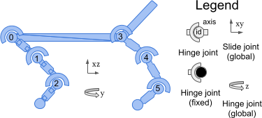
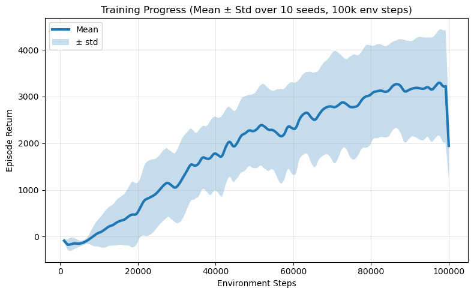

# Actor-Critic RL Algorithms 

We implement Soft Actor-Critic (SAC) algorithm for the Half-Cheetah environment. 

We briefly describe the main components of the implementation, and provide summary of the results.

# Project Structure

```
|── checkpoints            # Folder to save model checkpoints during training
├── conda_env.yaml         # Conda environment file for reproducibility                                                                                    
├── configs                 # Configuration files for training                                                                                     
├── README.md              # This file                                                                                     
├── run.py                 # Script to run training and evaluation                                                                                     
├── src                    # Source code folder for the implementation                                                                                     
│   ├── __init__.py        
│   ├── buffer             # Experience replay buffer implementation                                                                                   
│   │   ├── __init__.py    
│   │   ├── batch.py       # Batch class                                                                                   
│   │   └── buffer.py      # Buffer class                                                                                      
│   ├── eval               # Utilities for evaluation                                                                                      
│   │   ├── __init__.py    
│   │   └── eval.py        # Functions for evaluating the trained policy on one episode without exploration noise                                                                                      
│   ├── metrics            # Metrics calculation utilities                                                                                     
│   │   ├── __init__.py    
│   │   └── metrics.py     # Metric manager to track training progress                                                                                     
│   ├── nn                 # Neural network architectures for policy and value functions
│   │   ├── __init__.py    
│   │   ├── policy.py      # Policy network architecture                                                                                   
│   │   ├── q_network.py   # Q-network architecture                                                                                      
│   │   └── value.py       # Value network architecture                                                                                      
│   └── sac                
│       ├── __init__.py    
│       ├── gradient.py    # Gradient step for SAC                                                                                   
│       ├── step.py        # Training on one trajectory rollout                                                                                      
│       ├── train.py       # Training loop for SAC                                                                                   
│       └── utils.py       # SACNetworks container to manage several networks and their optimizers                                                                                   

```

# Getting Started

To set up the environment, run the following command in the terminal:

```bash
conda env create -f conda_env.yaml
```

To activate the environment, use:

```bash
conda activate actor_critic
```

# Training

To train the SAC agent, run the following command:

```bash
python run.py --config CONFIG_PATH
```

# Environment

We use the Half-Cheetah-v5 environment from the MuJoCo simulator. The environment simulates a 2D cheetah robot that must learn to run forward as fast as possible. The state space consists of the robot's joint angles and angular velocities, while the action space consists of the torques applied to the robot's joints. 



Actions are limited to the range [-1, 1], while observations are not normalized.

The reward function is defined as the forward velocity of the robot minus a penalty for the magnitude of the actions taken. By default, the episode truncates after 1000 steps, and never terminates.

# SAC Implementation

SAC combines several pillars of modern RL algorithms: it is an off-policy algorithm that uses experience replay, it is an actor-critic method that learns both a policy and value functions, and it is soft algorithm that incorporates an entropy term in the objective to encourage exploration. We also use the twin Q-network architecture to mitigate overestimation bias in value function estimation.

During training, we update the Q-networks (parametrized by $\theta_i$) and the value network (parametrized by $\psi$) using samples from the replay buffer $\mathcal D$. The policy is parametrized by $\phi$.

## Bellman Equation and Maximum Entropy Framework

In the maximum entropy framework, the optimal policy, values and Q-values are defined as the following.

The value is expected sum of rewards and entropies, given that the agent follows the policy $\pi$:

$$V_\pi(s) = \mathbb{E}_{\pi} \left[ \sum_{t=0}^{T} \gamma^t r(s_t, a_t) - \alpha \log \pi(a_t|s_t) | s_0 = s \right]$$

The Q-value is the expected sum of rewards and entropies, given that the agent takes action $a$ in state $s$ and then follows the policy $\pi$. Note that the first reward does not have the entropy term, since the action is already taken and there is no uncertainty about it:

$$Q_\pi(s, a) = r(s, a) + \mathbb{E}_{\pi} \left[ \sum_{t=1}^{T} \gamma^t r(s_t, a_t) - \alpha \log \pi(a_t|s_t) | s_0 = s, a_0 = a \right]$$

The soft Bellman equation has the following form:

$$ V(s) = \mathbb{E}_{a \sim \pi} [ Q(s, a) - \alpha \log \pi(a|s) ] $$

Here, alpha is the temperature parameter that controls the trade-off between maximizing reward and maximizing entropy.

Interestingly, that in standard RL, the policy improvement theorem work for greedy policies based on the Q-function. In soft RL, the policy improvement theorem works for softmax policies with temperature $\alpha$ based on the soft Q-function. 

It means that soft Q-function of the policy $\pi'$ is defined as:

$$ \pi'(a|s) \propto \exp\left(\frac{1}{\alpha} Q_\pi(s, a)\right) $$

will be greater than or equal to the soft Q-function of the original policy $\pi$.

In the limit of $\alpha \to 0$, the softmax approaches the hard max, and the soft Bellman equation approaches the standard Bellman equation. In this limit, SAC approaches the DDPG algorithm.

## Value Function Objective

From here, we can derive the objective for the value function as:

$$J_V(\psi) = \mathbb{E}_{s_t \sim \mathcal D} \left[ \frac{1}{2} (V_\psi(s_t) - \hat V(s_t))^2 \right]$$

where the target value is defined as:

$$\hat V(s_t) = \mathbb{E}_{a_t \sim \pi_\phi} [Q_\theta(s_t, a_t) - \alpha \log \pi_\phi(a_t|s_t)]$$

Here, we estimate the expectation over actions by sampling from the actual policy (we take one sample from the policy for each state in the batch).  To approximate the expectation over states, we sample a batch of states from the replay buffer. Note that we sample actions from the current policy on purpose: this way we treat the value function as a function of the current policy, i.e. this part of SAC is on-policy.

We use minimum of two Q-networks: $Q_\theta(s_t, a_t) = \min_{i=1,2} Q_{\theta_i}(s_t, a_t)$.

## Q-function Objective

We define the target for the Q-function as:

$$ J_Q(\theta_i) = \mathbb{E}_{(s_t, a_t, r_t, s_{t+1}) \sim \mathcal D} \left[ \frac{1}{2} (Q_{\theta_i}(s_t, a_t) - \hat Q_{\theta_i}(s_t, a_t))^2 \right]$$

where the target Q-value is defined as:
$$\hat Q_{\theta_i}(s_t, a_t) = r_t + \gamma V_{\bar{\psi}}(s_{t+1})$$

For stability of training, we define parameter $\bar{\psi}$ of the target value network as an exponential moving average of the parameters $\psi$ of the value network:

$$ \bar{\psi} \leftarrow \tau \psi + (1 - \tau) \bar{\psi} $$

By using slowly moving target in this loss, we treat the Q-function as some stationary object, which is an approximation of optimal Q-function. All estimates are based purely on the replay buffer, so this part of SAC is off-policy. 

## Policy Objective

As mentioned before, we want to update the policy towards the softmax distribution over actions defined by the current Q-function. Still, as our policy is parametrized by a neural network, we cannot directly set the policy to the softmax distribution. Instead, we can find the KL projection of the our parametrized family of policies to the softmax distribution. This is equivalent to minimizing the following objective:

$$ J_\pi(\phi) = \mathbb{E}_{s_t \sim \mathcal D} \left[ \mathbb{E}_{a_t \sim \pi_\phi} [ \alpha \log \pi_\phi(a_t|s_t) - Q_\theta(s_t, a_t) ] \right] $$

The projection means that we minimize KL between learned policy and the softmax policy. It turns out that policy improvement theorem holds for this projection. 

The important thing to note here is that we need to gradient the policy objective through the action samples. This is achieved by using the reparameterization trick in torch.

Here we also have $Q_\theta(s_t, a_t) = \min_{i=1,2} Q_{\theta_i}(s_t, a_t)$.

## Policy Parameterization

Because our action space is bounded, we use the squashed Gaussian policy. The outputs of the policy network are mean and log standard deviation of a Gaussian distribution. We sample from this distribution, and then apply the tanh function to squash the actions to the range [-1, 1]. This affects the log-probability of the actions, and we need to account for this in the policy objective. The log-probability of the squashed action can be calculated using the change of variables formula. Suppose that $u$ is the action sampled from the Gaussian distribution, and $a = \tanh(u)$ is the squashed action. Then:

$$ \log \pi(a|s) = \log \mathcal N(u; \mu(s), \sigma(s)) - \sum_{i=1}^{action\_dim} \log (1 - a_i^2) $$

## Training Loop

We measure the performance of the agent by evaluating the policy on one episode without exploration noise after end of each training epoch. Epoch is defined as one trajectory rollout. After sampling one transition, we add it to the replay buffer, and then perform a number of gradient steps on the SAC objective using samples from the replay buffer. 

During every gradient step, we update the value network, both Q-networks, and the policy network, and set the target value network parameters as an exponential moving average of the value network parameters.

# Hyperparameters 

We use the following hyperparameters for training:

```yaml
action_bound: 1.0
hidden_size: 256
lr: 3.0e-4
number_of_qs: 2
batch_size: 256
tau: 0.005
gamma: 0.99
alpha: 0.05
gradient_steps: 1
ckpt_dir: "checkpoints"
device: "gpu"
buffer_size: 1000000
max_env_steps: 1000000
```

All three network architectures (policy, value and Q-networks) have two hidden layers with ReLU activations. We use Adam optimizer.


# Results

We use number of environment steps as the x-axis, thus measuring the sample efficiency of the algorithm. We compute total episode return and distance traveled by the agent.


We also have animations of the agent's behavior depending on the different number of environment steps.
<p align="center">
  
</p>


<p align="center">
  
</p>
